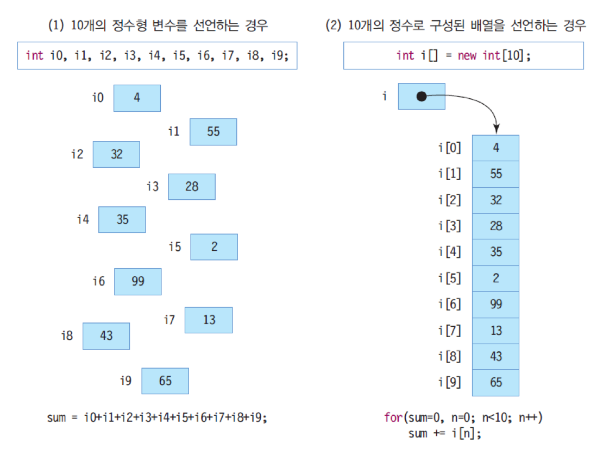
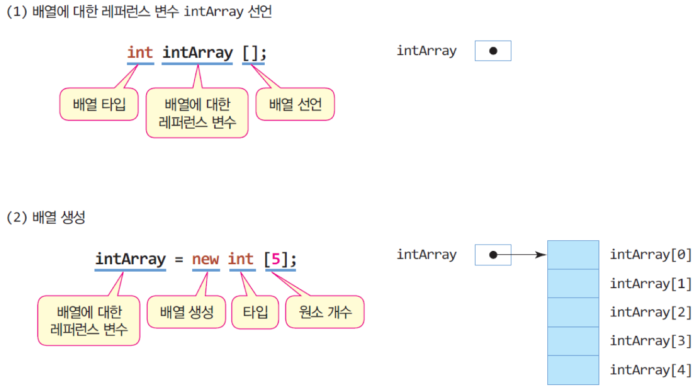
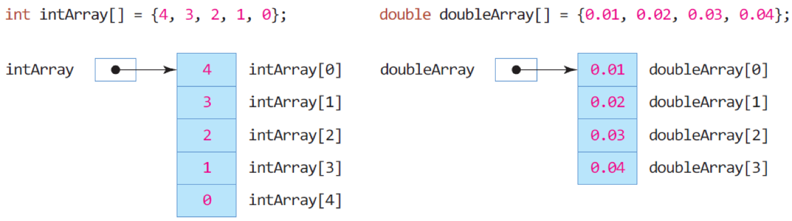
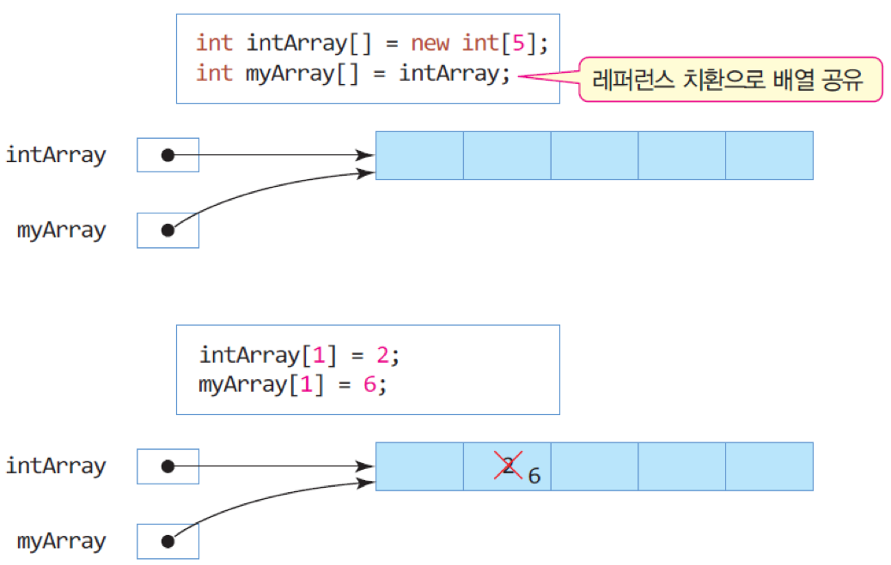
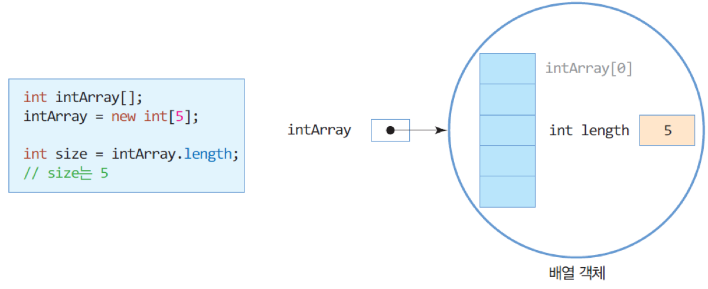

## 1. 자바 배열
### 가. 자바 배열의 필요성과 모양



### 나. 배열 선언과 생성


### 다. 배열 선언 및 생성 디테일
- 배열 선언과 배열 생성의 두 단계 필요
	- **배열 선언**
		- 배열의 이름 선언(배열 레퍼런스 변수 선언)

		```java
		int intArray[];
		```
		또는
		
		```java
		int[] intArray;
		```

	- **배열 생성**
		- 배열 공간 할당 받는 과정

		```java
		intArray = new int[5];
		```
		또는
		
		```java
		int intArray[] = new int[5]; // 선언과 동시에 배열 생성
		```
	- 배열 초기화
		
		```java
		int intArray[] = {4, 3, 2, 1, 0}; // 5개의 정수 배열 생성 및 값 초기화
		double doubleArray[] = {0.01, 0.02, 0.03, 0.04}; // 5개의 실수 배열 생성 및 값 초기화
		```
		
		

	
### 라. 배열 인덱스와 배열 원소 접근
- 배열 인덱스
	- 배열의 인덱스는 0 ~  (배열 크기 – 1)

		```java
		int intArray = new int[5]; 	// 인덱스는 0~4까지 가능
		intArray[0] = 5; 		// 원소 0에 5 저장
		intArray[3] = 6; 		// 원소 3에 6 저장
		int n = intArray[3]; 		// 원소 3의 값을 읽어 n에 저장
		
		```
	
	- 인덱스를 잘못 사용한 경우 (**오류**)

		```java
		int n = intArray[-2]; 		// 인덱스로 음수 사용 불가
		int m = intArray[5];		// 5는 인덱스의 범위(0~4) 넘었음
		```

	- 반드시 배열 생성 후 접근

		```java
		int intArray []; // 레퍼런스만 선언함
		
		intArray[1] = 8; // 오류. 배열이 생성되어 있지 않음
		```
		
### 마. 레퍼런스 치환과 배열 공유
- 레퍼런스 치환으로 두 레퍼런스가 하나의 배열 공유

	
		
### 바. 예제: 배열 선언 및 생성
- 양수 5개를 입력 받아 배열에 저장하고, 제일 큰 수를 출력하는 프로그램을 작성하라. 

	```java
	import java.util.Scanner;
	public class ArrayAccess {
		public static void main(String[] args) {
			Scanner scanner = new Scanner(System.in);
	
			int intArray[]; 
			intArray = new int[5];
			int max=0; // 현재 가장 큰 수
			System.out.println("양수 5개를 입력하세요.");
	
			for(int i=0; i<5; i++) {
				intArray[i] = scanner.nextInt(); 		// 입력 받은 정수를 배열에 저장
				if(intArray[i] > max) 		
					max = intArray[i]; 	// max 변경
			}
			System.out.print("가장 큰 수는 " + max + "입니다.");
	
			scanner.close();
		}
	}
	```
	
	실행결과
	
	```
	양수 5개를 입력하세요.
	1 39 78 100 99
	가장 큰 수는 100입니다..
	```
	
### 사. 배열의 크기, length 필드
- 자바의 배열은 객체로 처리
	- 배열 객체의 length 필드
		- 배열의 크기는 배열 객체의 length 필드에 저장

		
	
		- length 필드를 이용하여 배열의 모든 값을 출력하는 사례

		```java
		for(int i=0; i<intArray.length; i++) // intArray 배열 크기만큼 루프를 돈다.
			System.out.println(intArray[i]);
		```
		
### 아. 배열의 length 필드 활용
- 배열의 length 필드를 이용하여 배열 크기만큼 정수를 입력 받고 평균을 출력하라.

	```java
	import java.util.Scanner;
	public class ArrayLength {
		public static void main(String[] args) {
			Scanner scanner = new Scanner(System.in);
	
			System.out.println("5개의 정수를 입력하세요.");
			int intArray[] = new int[5];
	
			double sum=0.0;
			for(int i=0; i<intArray.length; i++)
				intArray[i] = scanner.nextInt(); // 키보드에서 입력받은 정수 저장
	
			for(int i=0; i<intArray.length; i++)
				sum += intArray[i]; // 배열에 저장된 정수 값을 더하기
	
			System.out.print("평균은 " + sum/intArray.length);
			scanner.close();
		}
	}
	```

	실행결과
	
	```
	5개의 정수를 입력하세요.
	2 3 4 5 9
	평균은 4.6.
	```