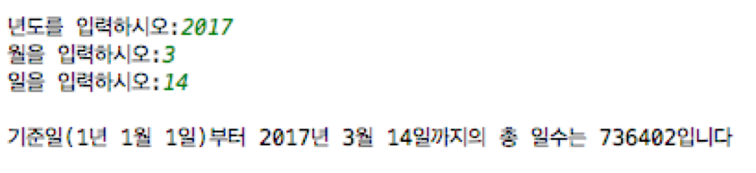

## 실습 - 조건문
1. 키보드로부터 특정 연도를 입력 받아 윤년인지 아닌지를 판별하는 프로그램을 작성하라.

	- [**힌트**] 윤년은 연도가 400으로 나누어 떨어지는 해는 무조건 윤년이고, 4로 나누어 떨어지지만 100으로 나누어 떨어지지 않는 해도 윤년이다. 그 외는 모두 평년이다.

	- [실행결과]

		```
		연도를 입력하시오:2016
		입력한 연도 2016는 윤년입니다.
		```
		
		```
		연도를 입력하시오:2019
		입력한 연도 2016는 평년입니다.
		```
2. 연 (1~), 월(1~12), 일(1~31)을 받아서, 기준일(1년1월1일)부터 입력받은 날까지의 일수를 계산하는 프로그램을 작성하라.

	- [**힌트**] 1년 1월 1일을 기준으로 입력된 날짜 까지의 일 수를 계산한다.
		1. 	주어진 연도 year에서 1을 빼서 365를 곱한다.
			- total\_days += (year-1)*365
		2. year/4-year/100+year/400가 윤년의 횟수이므로 이 값을 더한다
			- total\_days += year/4-year/100+year/400
		3. 주어진 연도가 윤년이고 주어진 월이 2월이나 1월이면 위 결과에서 1을 뺀다
		4. 위의 결과에 주어진 월과 일까지의 날 수를 더한다. 예를 들어서 
			- 2월 3일이면 total\_days += 31+3  	     // 1월의 일수(31)+3
			- 4월 15일 이면 total\_days += 31+28+31+15  //1월(31), 2월(28),3월(31).

	- 	[실행결과]
	
		