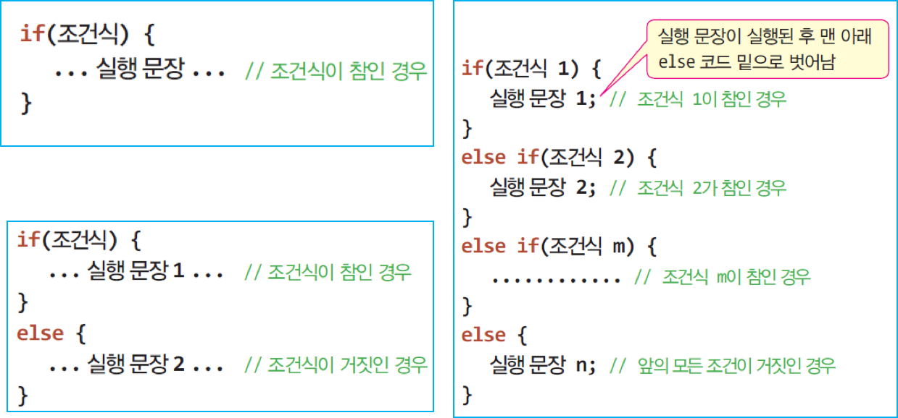
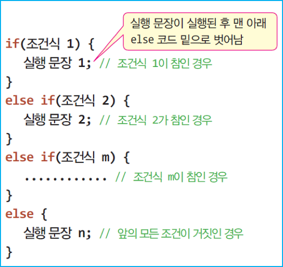
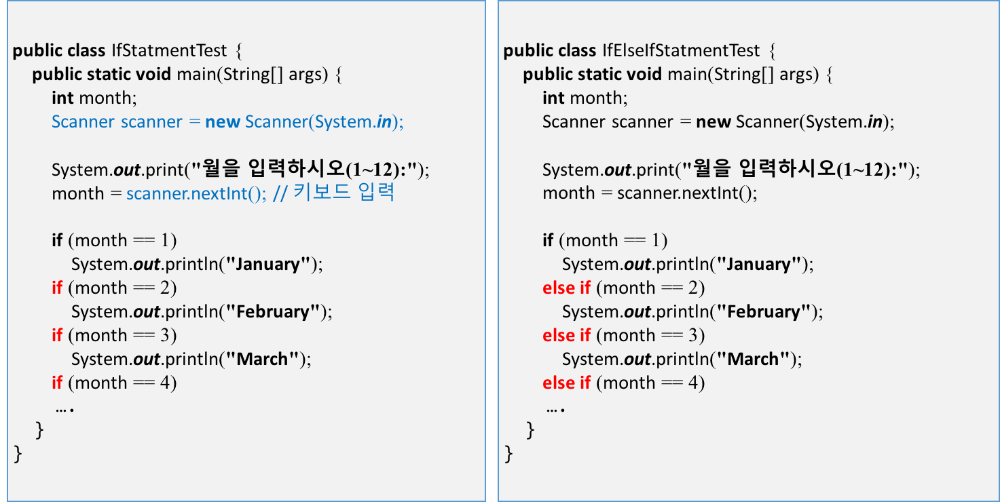

## 2. 조건문
### 가. 조건문 – if, if-else, if-else-if



### 나. 예제: if-else 사용하기
- 나이를 입력 받아 20대인지 판별하는 프로그램을 작성하라

	```java
	import java.util.Scanner;
	public class Twenties {
		public static void main(String[] args) {
			Scanner scanner = new Scanner(System.in);
	
			System.out.print("나이를 입력하시오:");
			int age = scanner.nextInt(); 
			if((age>=20) && (age<30)) { 		// age가 20~29 사이인지 검사
				System.out.print("20대입니다. ");
				System.out.println("20대라서 행복합니다!");
			}
			else
				System.out.println("20대가 아닙니다.");
	
			scanner.close();
		}
	}
	```
### 다. 다중 if-else 문
- 다중 if문
	- 조건문이 너무 많은 경우, switch 문 사용 권장                                                                                

	
	
- 예제 코드

	```java
	if(score >= 90) { // score가 90 이상
		grade = 'A';
	}
	else if(score >= 80) { // 80 이상 90 미만
		grade = 'B';
	}
	else if(score >= 70) { // 70 이상 80 미만
		grade = 'C';
	}
	else if(score >= 60) { // 60 이상 70 미만
		grade = 'D';
	}
	else { // 60 미만
		grade = 'F';
	}                                                                                                                                                          
	```
	
### 라. 예제 : 다중 if-else를 이용하여 학점 매기기
- 다중 if-else문을 이용하여 입력 받은 성적에 대해 학점을 부여하는 프로그램을 작성해보자.

	```java
	import java.util.Scanner;
	public class Grading {
		public static void main(String[] args) {
			char grade;
			Scanner scanner = new Scanner(System.in);
	
			System.out.print("점수를 입력하세요(0~100):");
	
			int score = scanner.nextInt(); // 점수 읽기
			if(score >= 90) // score가 90 이상
				grade = 'A';
			else if(score >= 80) // score가 80 이상 90 미만
				grade = 'B';
			else if(score >= 70) // score가 70 이상 80 이만
				grade = 'C';
			else if(score >= 60) // score가 60 이상 70 이만
				grade = 'D';
			else // score가 60 이만
				grade = 'F';
	
			System.out.println("학점은 " + grade + "입니다.");
			scanner.close();
		}
	}
	
	```

### 마. 중첩 if-else문사례
- if 문이나 else 문, 혹은 if-else 문에 if문이나 if-else문을 내포할 수 있다.

	```java
	import java.util.Scanner;
	public class NestedIf {
		public static void main(String[] args) {
			Scanner scanner = new Scanner(System.in);
	
			System.out.print("점수를 입력하세요(0~100):");
			int score = scanner.nextInt(); 
	
			System.out.print("학년을 입력하세요(1~4):");
			int year = scanner.nextInt(); 
	
			if(score >= 60) { // 60점 이상
				if(year != 4)
					System.out.println("합격!"); // 4학년 아니면 합격
				else if(score >= 70)
					System.out.println("합격!"); // 4학년이 70점 이상이면 합격
			else
				System.out.println("불합격!"); // 4학년이 70점 미만이면 불합격
			}
			else // 60점 미만 불합격
				System.out.println("불합격!");
	
			scanner.close();
		}
	}
	```
	
### 바. 조건문 – if 문과 다중 if-else의 비교
- 다음 두 가지 방식의 코드 중 어느 것이 더 효율적인가?

	