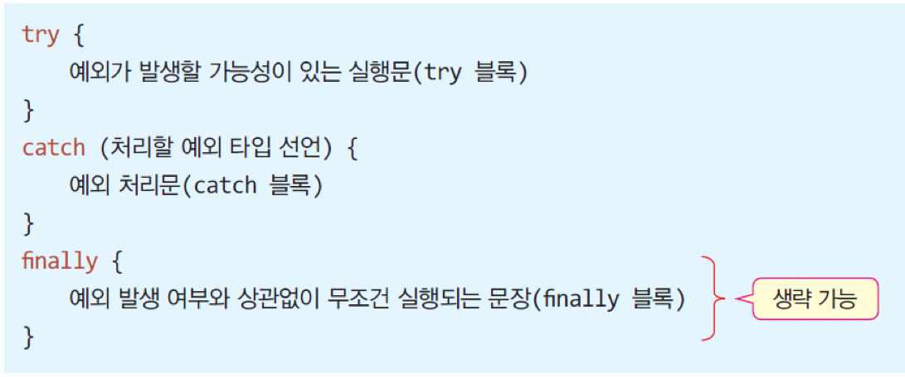
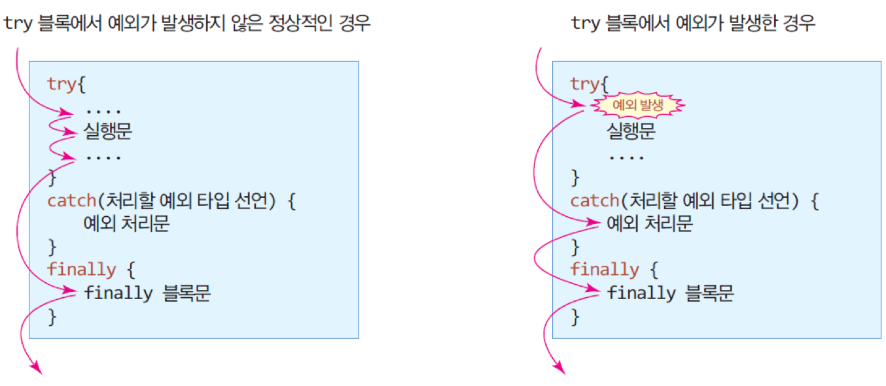
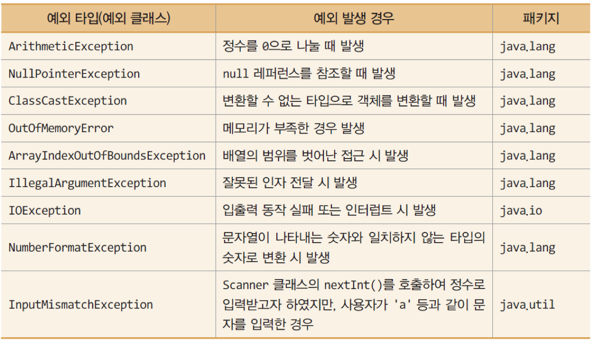

## 2. 예외처리
### 가. 자바의 예외 처리
- 예외(Exception)
	- 실행 중 오동작이나 결과에 악영향을 미치는 예상치 못한 상황 발생 
	- 자바에서는 실행 중 발생하는 에러를 예외로 처리
- 실행 중 예외가 발생하면
	- 자바 플랫폼은 응용프로그램이 예외를 처리하도록 호출
	- 응용프로그램이 예외를 처리하지 않으면 프로그램 강제 종료 시킴
- 예외 발생 경우
	- 정수를 0으로 나누는 경우
	- 배열의 크기보다 큰 인덱스로 배열의 원소를 접근하는 경우
	- 정수를 읽는 코드가 실행되고 있을 때 사용자가 문자를 입력한 경우

### 나. 예제 : 0으로 나누기 시 예외 발생으로 응용프로그램이 강제 종료되는 경우
- 두 정수를 입력받아 나눗셈을 하고 몫을 구하는 프로그램 코드이다. 사용자가 나누는 수에 0을 입력하면 자바 플랫폼에 의해 예외가 발생하여 프로그램이 강제 종료된다

	```java
	import java.util.Scanner;
	public class DivideByZero {
		public static void main(String[] args) {
			Scanner scanner = new Scanner(System.in);
			int dividend; // 나뉨수
			int divisor; // 나눗수
	
			System.out.print("나뉨수를 입력하시오:");
			dividend = scanner.nextInt(); // 나뉨수 입력
			System.out.print("나눗수를 입력하시오:");
			divisor = scanner.nextInt(); // 나눗수 입력
			System.out.println(dividend+"를 " + divisor + "로 나누면 몫은 "
						+ dividend/divisor + "입니다.");
		}
	}
	```
	
	실행결과
	
	```
	나뉨수를 입력하시오:100
	나눗수를 입력하시오:0
	Exception in thread "main" java.lang.ArithmeticException: / by zero
	at DivideByZero.main(DivideByZero.java:13)
	```

### 다. 자바의 예외 처리, try-catch-finally문
- 예외 처리
	- 발생한 예외에 대해 개발자가 작성한 프로그램 코드에서 대응하는 것
	- try-catch-finally문 사용
		- finally 블록은 생략 가능

		
		
### 라. 예외가 발생/발생하지 않은 경우 제어의 흐름

		 

### 마. 자바의 예외 클래스
- 자바 플랫폼은 응용프로그램이 실행 중 오류를 탐지할 수 있도록 많은 예외를 클래스 형태로 제공

	

### 바. 예외 클래스 사례
- 배열의 범위를 벗어나 원소를 접근하는 예외 처리
	- **ArrayIndexOutOfBoundsException** 예외

		```java
		int intArray [] = new int[5];
		
		try {
			intArray[3] = 10; // 예외 발생하지 않음
			intArray[6] = 5; // 예외 발생
		}
		catch(ArrayIndexOutOfBoundsException e) { // 객체 e에 예외 정보가 넘어옴
			System.out.println("배열의 범위를 초과하여 원소를 접근하였습니다.");
		}
		```

### 사. 0으로 나누는 예외에 대처하는 try-catch 블록 만들기
- try-catch-finally 블록을 이용하여, 정수를 0으로 나누는 경우에 "0으로 나눌 수 없습니다!"를 출력하는 프로그램을 작성하라.

	```java
	import java.util.Scanner;
	public class DevideByZeroHandling {
		public static void main(String[] args) {
			Scanner scanner = new Scanner(System.in);
			int dividend; // 나뉨수
			int divisor; // 나눗수
	
			System.out.print("나뉨수를 입력하시오:");
			dividend = scanner.nextInt(); // 나뉨수 입력
			System.out.print("나눗수를 입력하시오:");
			divisor = scanner.nextInt(); // 나눗수 입력
			try {
				System.out.println(dividend+"를 " + divisor + "로 나누면 몫은 " + dividend/divisor + "입니다.");
			}
			catch(ArithmeticException e) { // ArithmeticException 예외 처리 코드
				System.out.println("0으로 나눌 수 없습니다!");
			}
			finally {
				scanner.close(); // 정상적이든 예외가 발생하든 최종적으로 scanner를 닫는다.
			}
		}
	}
	```

	실행결과
	
	```
	나뉨수를 입력하시오:100
	나눗수를 입력하시오:0
	0으로 나눌 수 없습니다.
	```
	
### 아. 예제 : 입력오류시발생하는 예외(InputMismatchException)
- Scanner 클래스를 이용하여 3개의 정수를 입력받아 합을 구하는 프로그램을 작성하라. 사용자가 정수가 아닌 문자를 입력할 때 발생하는 InputMismatchException 예외를 처리하여 다시 입력받도록 하라.

	```java
	import java.util.Scanner;
	import java.util.InputMismatchException;
	
	public class InputException {
			public static void main(String[] args) {
				Scanner scanner = new Scanner(System.in);
				System.out.println("정수 3개를 입력하세요");
				int sum=0, n=0;
				for(int i=0; i<3; i++) {
					System.out.print(i+">>");
					try {
						n = scanner.nextInt(); // 정수 입력
					}
					catch(InputMismatchException e) {
						System.out.println("정수가 아닙니다. 다시 입력하세요!");
						scanner.next(); // 입력 스트림에 있는 정수가 아닌 토큰을 버린다.
						i--; // 인덱스가 증가하지 않도록 미리 감소
						continue; // 다음 루프
					}
					sum += n; // 합하기
				}
				System.out.println("합은 " + sum);
				scanner.close();
		}
	}
	```
	
	실행결과
	
	```
	정수 3개를 입력하세요
	0>>5
	1>>R
	정수가 아닙니다. 다시 입력하세요!
	1>>4
	2>>6
	합은 15
	```