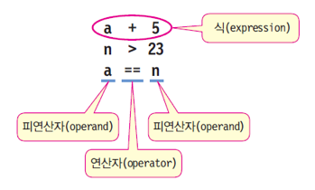
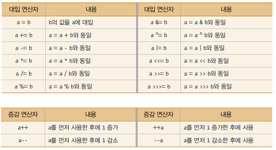
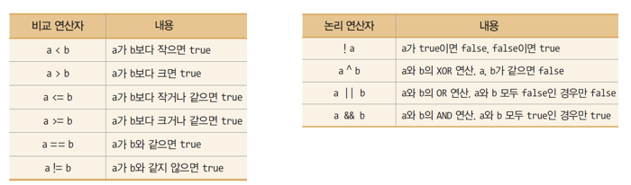

## 3. 식과 연산
### 가. 개념
- **식(Expression)**

	

- **연산**: 주어진 식을 계산하여 결과를 얻어 내는 과정


### 나. 산술연산자

- 단항 연산자: + (양수), - (음수)
- 이항 연산자: + (더하기), - (빼기), * (곱하기), / (나누기),  % (나머지)
- 산술 연산 
	- 정수끼리의 연산 결과는 정수
	- 실수끼리의 연산 결과는 실수
	- 정수와 실수의 연산 결과는 실수

	```java
	public class ArithmeticExpressionTest {
	    public static void main(String[] args) {
	        System.out.print("10+3=");
	        System.out.println(10+3);
	
	        System.out.print("5.21+3.1=");
	        System.out.println(5.21+3.1);
	
	        System.out.println("5+3.1="+(5+3.1));
	
	        System.out.println("5/2="+(5/2));
	        System.out.println("5/2.0="+(5/2.0));
	
	    }
	}
	```
- / (나누기),  % (나머지) 의 응용
	- 100의 자리, 10의 자리, 1의 자리 분리

	```java
	public class ArithmeticExpressionTest {
	    public static void main(String[] args) {
	        //...	
	        System.out.println("365의 100의 자리수=" + (365/100));
	        System.out.println("365의 10의 자리수=" + (365%100)/10);
	        System.out.println("365의 1의 자리수=" + (365%10));
	
	        System.out.println("365 % 2 =" + 365 % 2);    //1이면 홀수, 0이면 짝수
	
	        System.out.println("366 % 3 =" + 366 % 3);     // 0이면 3의 배수,
	    }
	}
	```
- 홀수 여부 판단

	```java
	int r = n % 2; 	// r이 1이면 n은 홀수, 0이면 짝수
	```

- 3의 배수인지 여부 판단

	```java
	int s = n % 3; 	// s가 0이면 n은 3의 배수
	```

---
### 나. 대입 연산자, 증감 연산자


- 예제

	```java
	int a, b = 4;
	a = b++; 	// b가 a에 대입된 후 b 증가. 결과 a=4, b=5
	```
	
	```java
	int a, b = 4;
	a = ++b; 	// b가 증가한 후, b 값이 a에 대입. 실행 결과 a=5, b=5
	```
	
- 다음 코드의 실행 결과는?

	```java
	public class AssignmentIncDecOperatorTest {
	    public static void main(String[] args) {
	        int a=3, b=3, c=3;
	
	        // 대입 연산자 사례
	        a += 3; // a=a+3 = 6
	        b *= 3; // b=b*3 = 9
	        c %= 2; // c=c%2 = 1
	        System.out.println("a=" + a + ", b=" + b + ", c=" + c);
	
	        int d=3;
	        // 증감 연산자 사례
	        a = d++; // a=3, d=4
	        System.out.println("a=" + a + ", d=" + d);
	        a = ++d; // d=5, a=5
	        System.out.println("a=" + a + ", d=" + d);
	        a = d--; // a=5, d=4
	        System.out.println("a=" + a + ", d=" + d);
	        a = --d; // d=3, a=3
	        System.out.println("a=" + a + ", d=" + d);
	    }
	}
	```
	
---
### 다. 비교 연산자와 논리 연산자


- 예제

	```java
	// 나이(int age)가 20대인 경우
	(age >= 20) && (age < 30) 
	
	// 문자(char c)가 대문자인 경우									
	(c >= 'A') && (c <= 'Z') 										
	
	// (x,y)가 (0,0)과 (50,50)의 사각형 내에 있는 경우
	(x>=0) && (y>=0) && (x<=50) && (y<=50) 
	```

- 다음 소스의 실행 결과는 무엇인가?

	```java
	public class LogicalOperator {
	    public static void main (String[] args) {
	        System.out.println('a' > 'b');
	        System.out.println(3 >= 2);
	        System.out.println(-1 < 0);
	        System.out.println(3.45 <= 2);
	        System.out.println(3 == 2);
	        System.out.println(3 != 2);
	        System.out.println(!(3 != 2));
	        System.out.println((3 > 2) && (3 > 4));
	        System.out.println((3 != 2) || (-1 > 0));
	        System.out.println((3 != 2) ^ (-1 > 0));
	    }
	}
	
	```