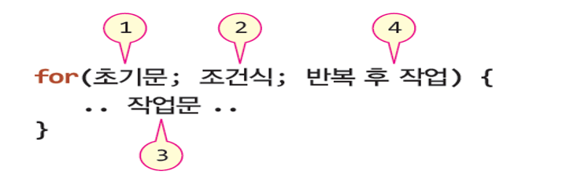
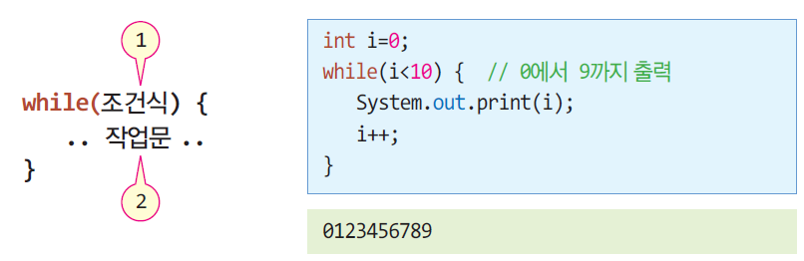
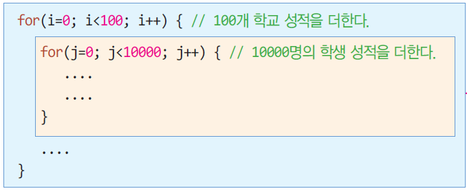

#  반복문
- [for 문](#1)
- [while 문](#2)
- [do-while 문](#3)
- [중첩 반복문](#4)
- [continue 문](#5)
- [break 문](#6)

## 0. 시작 예제
- 1에서 9까지 숫자를 출력하는 Java 프로그램을 작성해 보자

	```java
	public class PrintNumberSample {
		public static void main(String[] args) {
			System.out.print(1);
			System.out.print(2);
			System.out.print(3);
			System.out.print(4);
			System.out.print(5);
			System.out.print(6);
			System.out.print(7);
			System.out.print(8);
			System.out.print(9);
		}
	}
	```
	- 단순한 코드가 반복

<a name="1"></a>
## 1. **for** 문
- 가장 많이 사용하는 반복문

	

- 예제 1
	- for 문을 이용하여 1부터 10까지 덧셈으로 표시하고 합을 출력하라.

		```java
		public class ForSample1 {
			public static void main(String[] args) {
				int i, sum=0;

				for(i=1; i<=10; i++) { // 1~10까지 반복
					sum += i;
					System.out.print(i); // 더하는 수 출력

					if(i<=9) // 1~9까지는 '+' 출력
						System.out.print("+");
					else { // i가 10인 경우
						System.out.print("="); // '=' 출력하고
						System.out.print(sum); // 덧셈 결과 출력
					}
				}
			}
		}
		```
		출력 결과

		```
		1+2+3+4+5+6+7+8+9+10=55
		```
- 예제 2
	- for 문을 이용하여 0부터 10까지 숫자 중 짝수 만을 출력하라.
		- 방식1
		```java
		public class ForSample2 {
			public static void main(String[] args) {
				for(i=0; i<=10; i=i+2) {
					System.out.println(i);
				}
			}
		}
		```
		- 방식2
		```java
		public class ForSample2 {
			public static void main(String[] args) {
				for(i=0; i<=10; i++) {
					if (i%2 == 0)
						System.out.println(i);
				}
			}
		}
		```

<a name="2"></a>
## 2. **while** 문
- while 문의 구성과 코드 사례
	- 조건식이 ‘참’인 동안 반복 실행
	

- 실습
	- while 문을 이용하여 1부터 10까지 덧셈으로 표시하고 합을 출력하라.

<a name="3"></a>
## 3. **do-while** 문
- do-while 문의 구성과 코드 사례
	- 조건식이 ‘참’인 동안 반복 실행
	- 작업문은 한 번 반드시 실행

	

- 예제 3
	- do-while문을 이용하여 'a'부터 'z'까지 출력하는 프로그램을 작성하라.

		```java
		public class DoWhileSample {
			public static void main (String[] args) {
				char a = 'a';

				do {
					System.out.print(a);
					a = (char) (a + 1);
				} while (a <= 'z'); 	
			}
		}
		```

		실행결과
		
		```
		abcdefghijklmnopqrstuvwxyz
		```

## 중간 점검 문제
1. 다음 코드의 출력을 쓰시오.

	```java
		int n = 10;
		while (n>0) {
			System.out.println(n);
			n = n - 3;
		}
	```
2. 위와 동일한 결과가 나올 수 있도록 프로그램을 **for** 문과 **do-while** 문으로 변경하시오

<a name="4"></a>
## 4. 중첩 반복
- 반복문이 다른 반복문을 내포하는 구조
	- 10000명의 학생이 있는 100개 대학의 모든 학생 성적의 합을 구할 때,
for 문을 이용한 이중 중첩 구조

	

- 예제
	- 2중 중첩된 for문을 이용하여 구구단을 출력하는 프로그램을 작성하라.

		```java
		public class NestedLoop {
			public static void main(String[] args) {

				for(int i=1; i<10; i++) { // 단에 대한 반복. 1단에서 9단
					for(int j=1; j<10; j++) { // 각 단의 곱셈
						System.out.print(i + "*" + j + "=" + i*j); // 구구셈 출력
						System.out.print('\t'); // 하나씩 탭으로 띄기
					}
					System.out.println(); // 한 단이 끝나면 다음 줄로 커서 이동
				}
			}
		}
		```
- 실습
	- 아래와 같이  출력되는  프로그램을 작성하라.

		

<a name="5"></a>
## 5. **continue** 문
- 반복문을 빠져 나가지 않고, 다음 반복으로 제어 변경

	

- 예제
	- 1에서 10까지의 정수 중에서 짝수의 합을 구하여 출력하는 프로그램을 작성하라.

		```java
		Public class ContinueExample {
			public static void main(String[] args) {
				int sum=0;

				for(int i=1; i<=10; i++) {
					if(i%2!=0) continue; // 짝수가 아닌 경우 더하지 않고 다음 반복으로 진행
					else sum += i; // 양수인 경우 덧셈
				}
				System.out.println(“1에서 10까지의 정수 중에서 짝수의 합은 " + sum);

				scanner.close();
			}
		}
		```

		실행결과

		```
		1에서 10까지의 정수 중에서 짝수의 합은 30
		```

<a name="6"></a>
## 6. **break** 문
- 반복문 하나를 즉시 벗어갈 때 사용
	- 하나의 반복문만 벗어남
	- 중첩 반복의 경우 안쪽 반복문의 break 문이 실행되면 안쪽 반복문만 벗어남

	

- 예제
	- "exit"이 입력되면 while 문을 벗어나도록 break 문을 활용하는 프로그램을 작성하라.

		```java
		import java.util.Scanner;
		public class BreakExample {
			public static void main(String[] args) {
				Scanner scanner = new Scanner(System.in);
				System.out.println("exit을 입력하면 종료합니다.");

				while(true) {
					System.out.print(">>");
					String text = scanner.nextLine();
					if(text.equals("exit")) // "exit"이 입력되면 반복 종료
						break; // while 문을 벗어남
				}

				System.out.println("종료합니다...");
				scanner.close();
			}
		}
		```

## 중간점검 문제
1. 다음 코드의 출력을 쓰시오.

	```java
	int n = 12;
	while (n > 0) {
			n = n - 2;
			if( n == 6 )
					break;
			System.out.println(n);
	}

	```

## 실습 과제
- 구구단 (1단-9단)을 아래와 같이 1줄에 3단씩 출력하도록 프로그램을 작성하시오.

	- 실행결과

	```
	1*1=1	2*1=2	3*1=3	
	1*2=2	2*2=4	3*2=6	
	1*3=3	2*3=6	3*3=9	
	1*4=4	2*4=8	3*4=12	
	1*5=5	2*5=10	3*5=15	
	1*6=6	2*6=12	3*6=18	
	1*7=7	2*7=14	3*7=21	
	1*8=8	2*8=16	3*8=24	
	1*9=9	2*9=18	3*9=27	
	
	4*1=4	5*1=5	6*1=6	
	4*2=8	5*2=10	6*2=12	
	4*3=12	5*3=15	6*3=18	
	4*4=16	5*4=20	6*4=24	
	4*5=20	5*5=25	6*5=30	
	4*6=24	5*6=30	6*6=36	
	4*7=28	5*7=35	6*7=42	
	4*8=32	5*8=40	6*8=48	
	4*9=36	5*9=45	6*9=54	
	
	7*1=7	8*1=8	9*1=9	
	7*2=14	8*2=16	9*2=18	
	7*3=21	8*3=24	9*3=27	
	7*4=28	8*4=32	9*4=36	
	7*5=35	8*5=40	9*5=45	
	7*6=42	8*6=48	9*6=54	
	7*7=49	8*7=56	9*7=63	
	7*8=56	8*8=64	9*8=72	
	7*9=63	8*9=72	9*9=81	
	```