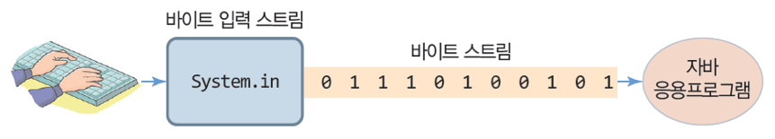
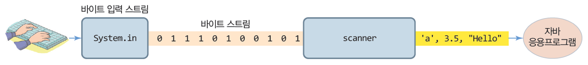
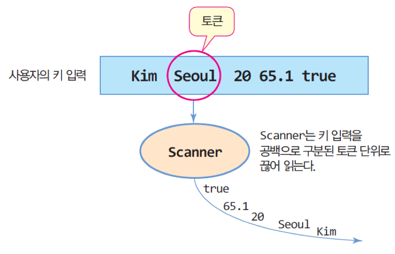
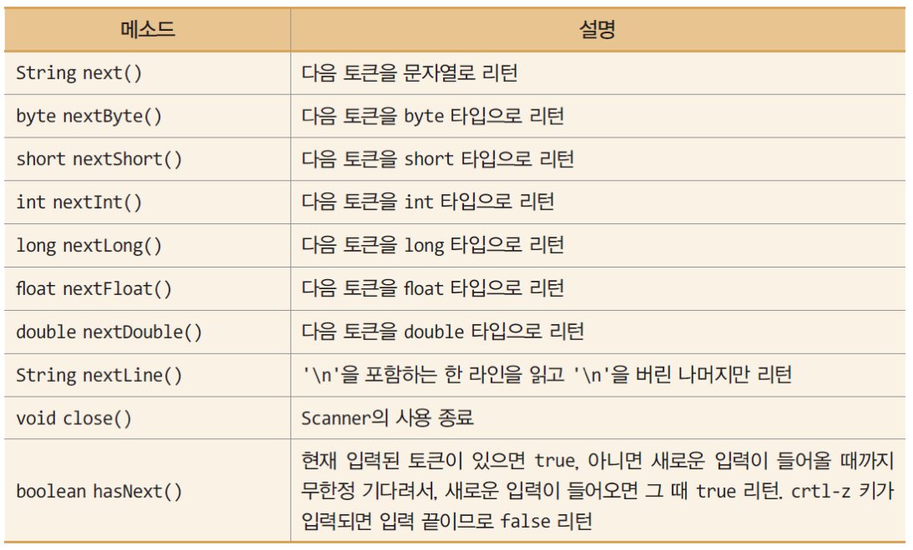

## 1. 자바의 키 입력
### 가. 자바의 키 입력과 System.in
- **System.in**
	- 키보드와 연결된 자바의 표준 입력 스트림
	- 입력되는 키를 바이트(문자 아님)로 리턴하는 저수준 스트림
	- <span style="color:red">
		System.in을 직접 사용하면 바이트를 문자나 숫자로 변환하는 많은 어려움 있음	  </span>


	

### 나. Scanner와 Scanner 객체 생성
- **java.util.Scanner 클래스**
	- 읽은 바이트를 문자, 정수, 실수, 불린, 문자열 등 다양한 타입으로 변환하여 리턴
- **Scanner 객체 생성 코드**

	```java
	import java.util.Scanner; // 임포트 문 필요
	//...
	Scanner a = new Scanner(System.in); // Scanner 객체 생성
	```

	- 키보드에 연결된 System.in에게 키를 읽게 하고, 원하는 타입으로 변환하여 리턴
		

### 다. Scanner를 이용한 키 입력
- **Scanner에서 키 입력 받기**
	- Scanner는 입력되는 키 값을 공백으로 구분되는 토큰 단위로 읽음
	- 공백 문자 :‘\t’,‘ \f’,‘ \r’,‘ ’,‘ \n’

	

- 예제코드
	
	```java
	Scanner scanner = new Scanner(System.in);
	
	String name = scanner.next(); // "Kim"
	String city = scanner.next(); // "Seoul"
	int age = scanner.nextInt(); // 20
	double weight = scanner.nextDouble(); // 65.1
	boolean single = scanner.nextBoolean(); // true
	```

### 라. Scanner 주요 메소드



### 마. 예제  : Scanner를 이용한 키 입력 연습

- Scanner를 이용하여 이름, 도시, 나이, 체중, 독신 여부를 입력 받고 다시 출력하는 
프로그램을 작성하라.

	```java
	import java.util.Scanner;
	
	public class ScannerEx {
		public static void main(String args[]) {
			System.out.println("이름, 도시, 나이, 체중, 독신 여부를 빈칸으로 분리하여 입력하세요");
	
			Scanner scanner = new Scanner(System.in);
			String name = scanner.next(); 
			System.out.println("당신의 이름은 " + name + "입니다.");
			String city = scanner.next(); 
			System.out.println("당신이 사는 도시는 " + city + "입니다.");
			int age = scanner.nextInt(); 
			System.out.println("당신의 나이는 " + age + "살입니다.");
			double weight = scanner.nextDouble(); // 실수 토큰 읽기
			System.out.println("당신의 체중은 " + weight + "kg입니다.");
			boolean single = scanner.nextBoolean();
			System.out.println("당신은 독신 여부는 " + single + "입니다.");
			
			scanner.close();
		}
	}
```
- 실행결과

	```
	이름, 도시, 나이, 체중, 독신 여부를 빈칸으로 분리하여 입력하세요.
	Kim Seoul 20 65.1 true
	당신의 이름은 Kim입니다.
	당신이 사는 도시는 Seoul입니다.
	당신의 나이는 20살입니다.
	당신의 체중은 65.1kg입니다.
	당신은 독신 여부는 true입니다.
	```
