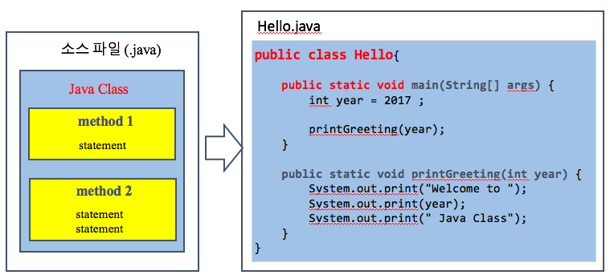

## 1. 자바 프로그램 기본
### 가. 프로그램 구조



- Java 소스 파일 (*.java)에는 하나 이상의 Java 클래스가 정의될 수 있음
- **public** 으로 선언된 클래스는 반드시 같은 이름의 소스파일 (.java)에 정의되어야 함
- **하나의 Java 클래스**에는 **하나 이상의 메소드(method)**를 포함하고 있고, **하나의 메소드**는 **하나 이상의 문장(statement)**으로 구성되어 있음
	- 메소드는 모듈화된 프로그램 코드 블록을 나타냄

### 나. 주석
- 여러 라인 주석은 /*와 */로 구성
- /** 에서 */까지의 주석은 javadoc에 의해서 추출되어 HTML 문서로 생성됨
- // 은 한 라인의 주석을 작성할 때 사용됨
- 예제

	```java
	/**
	 * Hello 프로그램은 main() 메소드와 printGreeting(int)로 구성된 프로그램
	 */
	public class Hello{
	
	    /**
	     * 프로그램의 시작 포인트
	     * @param args
	     */
	    public static void main(String[] args) {
	        int year = 2019 ;
	
	        printGreeting(year);
	    }
	
	    /**
	     * 연도를 입력 받아 해당 연도 Java Class로의 환영 메시지 출력
	     * @param year 연도
	     */
	    public static void printGreeting(int year) {
	        System.out.print("Welcome to ");        // 문자열 "Welcome to " 출력
	        System.out.print(year);                   // 정수 year 값 2017 출력
	        System.out.print(" Java Class");        // 문자열 " Java Class" 출력
	    }
	}
	```
