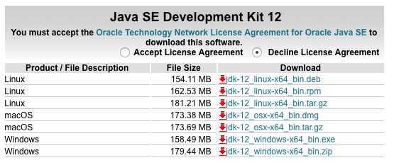
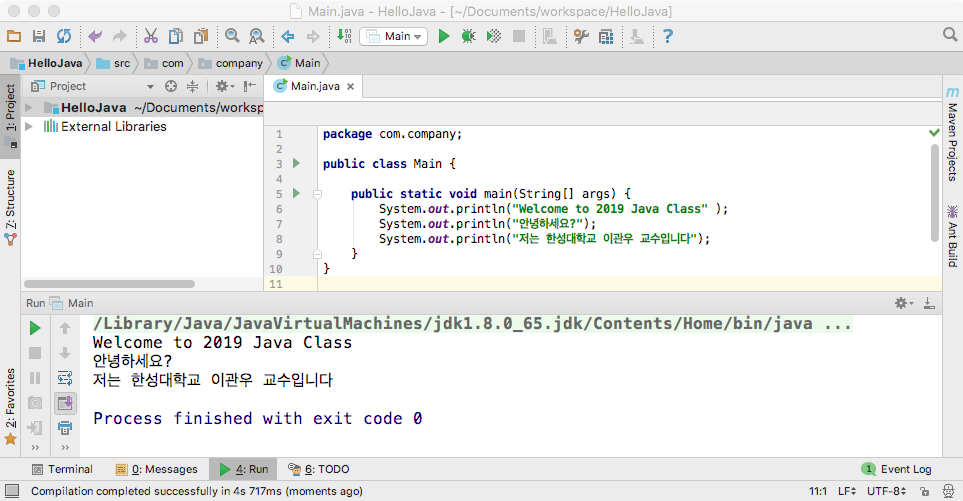

# 자바 프로그램 작성 및 실행 (실습)

## 1.	Java 개발환경 설치
###A.	JDK 다운로드 및 설치
1.	아래 링크를 통해서 접속

	http://www.oracle.com/technetwork/java/javase/downloads/index-jsp-138363.html

2. **Java DOWNLOAD** 클릭후 다음하면에서, [**Accept License Agreement**] 선택하고, 자신의 컴퓨터에 맞는 파일을 선택하여 다운로드
	- 가령, Windows 컴퓨터인 경우, Windows 운영체제가 32비트이면 Window x86을 64비트이면 Windows x64를 선택해야 함

	

3. 다운로드한 파일 실행하여 설치

###B. INTELLIJ IDEA IDE 다운로드 및 설치
1. 아래 링크를 통해서 접속
	
	https://www.jetbrains.com/idea/?fromMenu
2. **Community** 버전 다운로드
3. 다운로드한 파일 실행하여 설치

---
## 2. IntelliJ IDEA IDE를 이용한 자바 프로그램 개발
### A. 프로젝트 생성
1. **Create New Project** 메뉴 선택

	
	
2. **Project SDK**의 드롭다운 메뉴에서 설치된 버전의 Java SDK를 선택 후, **Next** 버튼 클릭
	- Java SDK가 안보이는 경우에는 New 버튼을 누른 후, 설치된 Java SDK 폴더를 선택 후, OK 버튼 클릭

	
3. **Create project from template** 체크 후에, **Command Line App** 선택하고 **Next** 버튼 클릭

4. **Project name** 칸에 프로젝트 이름(예, *HelloJava*)을 입력하고 **Project location**에 프로젝트를 폴더 위치를 지정 후에, **Finish** 버튼 클릭

### B. 자바 소스 작성
1. 자바 소스 코드 작성

	```java
	package com.company;
	
	public class Main {
	
	    public static void main(String[] args) {
	        System.out.println("Welcome to 2019 Java Class" );
	        System.out.println("안녕하세요?");
	        System.out.println("저는 한성대학교 이관우 교수입니다");
	    }
	}
	
	```
2. 컴파일 및 실행
	- **Run**>**Run 'Main'** 메뉴 선택 혹은 연두색의 아이콘() 클릭

	
	
---
##3.	Java 프로그램 실습
1. 새로운 Java 프로젝트를 생성한다.
2. 화면에 자신의 이름, 나이, 학교 등의 정보를 출력하는 자바 프로그램을 작성해 보자.
3. 작성된 자바 프로그램을 컴파일하고 실행하여 실행결과를 확인해 본다.
