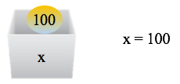
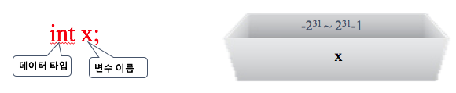
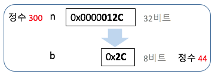
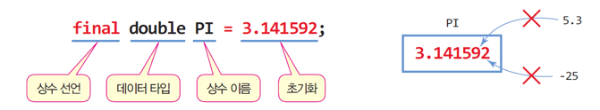

## 2. 변수와 데이터 타입
### 가. 개념
- **변수**: 데이터를 저장하는 이름이 부여된 공간

	

- **데이터 타입**: 데이터의 형태 및 허용 범위 

	데이터 타입 | 형태 | 허용범위
	---------|-----|-------
	boolean | true or false |
	byte | 정수 | -128~127
	short | 정수 | -32768~32767
	int | 정수 | -2^31 ~ 2^31 -1
	long | 정수 | -2^63 ~ 2^63 -1
	char | Unicode|
	float	| 실수 | -3.4E38 ~ 3.4E38
	double | 실수 | -1.7E308 ~ 1.7E308

### 나. 변수 선언
- 데이터 타입에 맞는 **데이터 저장 공간을 생성**하고, 이 공간에 **이름을 부여**

	

- 동일한 타입의 변수를 여러 개 선언할 경우, 콤마로 분리

	```java
	int year, month, day;
	```

- 변수 선언 시에 초깃값을 지정할 수 있음

	```java
	boolean flag = true;
	double height = 180.1;
	char c1, c2, c3=‘N’;
	```	

- 주의할 점
	- 논리형 (boolean type)은 true 아니면 false 만 가질 수 있다.
	
		```java
		boolean flag = 0;   //(오류)
		```
	
	- 변수 선언 시, 초깃값을 대응 시킬 경우에는 변수의 범위를 벗어나는 값을 대입할 수 없다.
	
		```java
		byte number = 300;  //(오류)
		```
		
	- 실수 값은 “double” 타입으로, 정수 값은 “int” 타입으로 인식된다.

		```java
		float temperature = 25.6;         //(오류)
		float temperature = 25.6f;
		```
		
	- 변수 이름 규칙
		- 식별자는 유니코드 문자와 숫자의 조합
		- 식별자의 첫 문자는 일반적으로 유니코드 문자, 첫문자가 _, $로 시작될 수도 있다.
		- 두 번째 문자부터는 문자, 숫자, _, $ 등이 가능하다. 
		- 대문자와 소문자는 구별된다. 
		- 식별자의 이름으로 키워드(keyword)를 사용해서는 안 된다. 

---
### 중간 점검 문제
1. 변수에 새로운 값이 대입되면 기존의 값은 어떻게 되는가?

2. days와 Days는 동일한 변수인가 아닌가?

3. 다음 중에서 올바르지 않은 변수이름은?
    
    x, 8items, march09, sales_report, theProfit2009, #ofPlayer

---
### 다. 타입 변환
- 자동 타입 변환
	- 컴파일러에 의해 원래 타입보다 큰 타입으로 자동 변환

		```java
		long m = 25;  // 25는 int 타입 25가 long 타입으로 자동 변환
		```
		
- 강제 타입 변환
	- 개발자의 의도적 타입 변환
	- () 안에 명시적으로 타입 변환 지정
	- 강제 변환은 값 손실 우려
	- 예제

		```java
		int n = 300;
		byte b = (byte) n;
		```
		
		
		```java
		double d = 1.9;
		int n = (int)d;  // n = 1
		```
- 예제: 타입변환
	- 자동 타입 변환과 강제 타입 변환이 들어 있는 코드이다. 실행 결과는 무엇인가?
 
	```java
	public class TypeConversion {
	    public static void main(String[] args) {
	        byte b = 127;
	        int i = 100;
	
	        System.out.println(b+i); 						// b가 int 타입으로 자동 변환
	        System.out.println(10/4);
	        System.out.println(10.0/4); 				// 4가 4.0으로 자동 변환
	        System.out.println((char)0x12340041);
	        System.out.println((byte)(b+i));
	        System.out.println((int)2.9 + 1.8);
	        System.out.println((int)(2.9 + 1.8));
	        System.out.println((int)2.9 + (int)1.8);
	    }
	}
	
	``` 
---
### 라. 상수
- <span style="color:red">**final**</span> 키워드 사용하여 선언
- 선언 시 초깃값 지정
	
	
- 실행 중 값 변경 불가

	```java
	public static void main(String args[]) {
		final double PI = 3.142592;
		 
		System.out.println("PI="+PI);
		PI = 3.14;		// error: 변경 불가 
		System.out.println("PI="+PI);
	}
	
	```